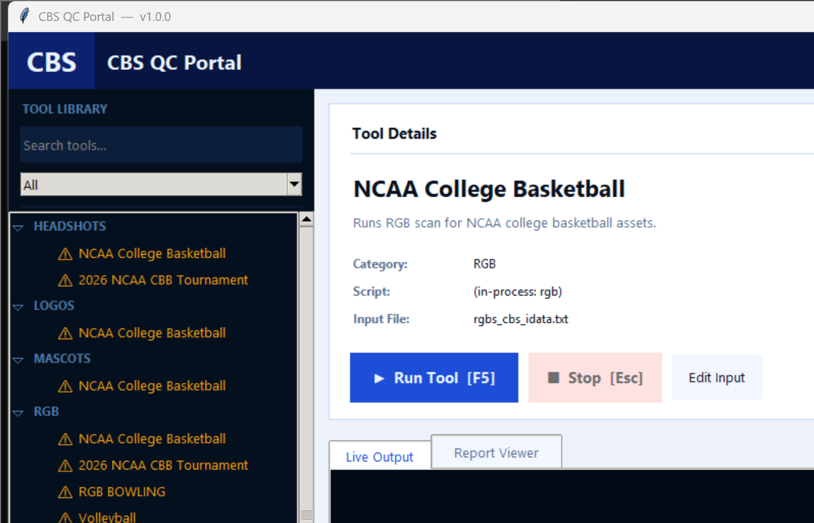

# Broadcast-QA-2026

**Broadcast-QA-2026** is a desktop QC portal for sports-graphics asset checks. It gives
operators a single dashboard to run automated quality-control scans across
many sports and review the results without touching the command line.

## 📌 Looking for the code?

> [!IMPORTANT]
> ### This is a public *overview* repo — it does **not** contain the application source.
>
> The actual code lives in a **private** repository.
> **👉 Reach out to me directly if you need access.**

## What it does

- **One-click QC scans** grouped by category and sport
- **RGB color checks** — validates team color values against design assets
- **Headshot checks** — confirms player headshots are present and named correctly
- **Logo scans** — verifies team logo variants exist
- **Mascot checks** — cross-references mascot data
- **Batch runs** — pick a set of tools and run them in sequence
- **Live output + report viewer** — watch a run stream, then read the report inline
- **Run history** — recent runs with status and timing, one click to open the report

## Built with

- Python 3
- Tkinter (standard-library GUI)

## Status

Internal tool, actively maintained. Screenshot above reflects the current UI.
